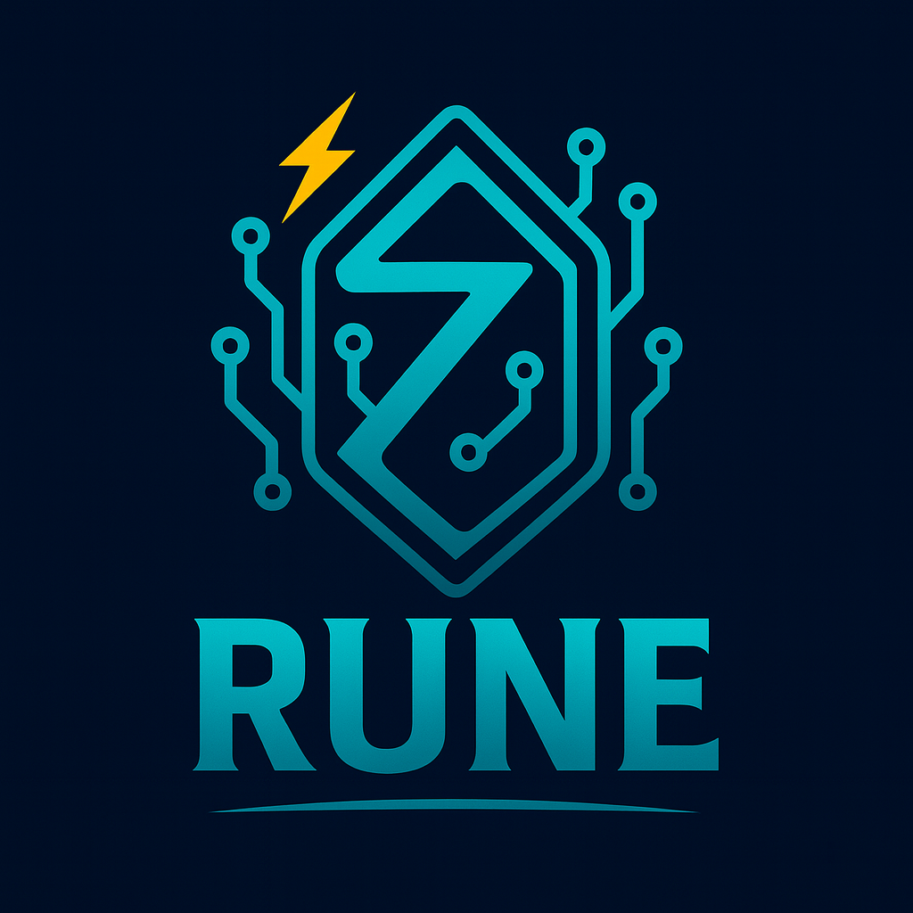

# Rune

<div align="center">
  

  **Premier Zig library for Model Context Protocol (MCP)**

  [](https://ziglang.org/)
  [](https://spec.modelcontextprotocol.io/)
  [](https://github.com/ghostkellz/rune)
  [](https://github.com/ghostkellz/rune)
  [](LICENSE)
</div>

## DISCLAIMER

⚠️ **EXPERIMENTAL LIBRARY - FOR LAB/PERSONAL USE** ⚠️

This is an experimental library under active development. It is
intended for research, learning, and personal projects. The API is subject
to change!

Rune is a **next-generation Zig 0.16-dev** MCP library that empowers your Zig applications to seamlessly integrate with LLM tools and agent runtimes. Built with functional programming principles and a clean, async-first API, Rune is lightweight, zero-bloat, and designed for effortless embedding in editors, CLIs, TUIs, and system daemons.

## ✨ Features

- ⚡ **Lightning Fast**: Idiomatic Zig with zero hidden allocations
- 🔌 **Dual Mode**: Full MCP client & lightweight server capabilities
- 🔒 **Security First**: Optional consent hooks and guard rails (GhostGuard-style)
- 🌐 **Protocol Agnostic**: JSON-RPC over stdio, WebSocket, and HTTP(S)
- 📜 **Schema Aware**: Built-in OpenAPI/JSON Schema interoperability
- 🦀 **Rust FFI Ready**: Seamless bindings for Rust projects and Glyph servers
- 🎯 **Functional**: Leveraging Zig's compile-time capabilities for type-safe functional patterns
- 🔄 **Async Native**: Built from the ground up for async/await workflows

---

## 🚀 Quick Start

### Installation

```sh
zig fetch --save https://github.com/ghostkellz/rune/archive/refs/heads/main.tar.gz

```

Add to your `build.zig`:
```zig
const rune = b.dependency("rune", .{ .target = target, .optimize = optimize });
exe.root_module.addImport("rune", rune.module("rune"));
```

### Basic Usage

#### MCP Client
```zig
const std = @import("std");
const rune = @import("rune");

pub fn main() !void {
    var gpa = std.heap.GeneralPurposeAllocator(.{}){};
    defer std.debug.assert(!gpa.deinit());
    const alloc = gpa.allocator();

    var client = try rune.Client.connectWs(alloc, "wss://localhost:7331");
    defer client.deinit();

    const out = try client.invoke(.{
        .tool = "read_file",
        .input = .{ .path = "/etc/hosts" },
    });
    std.debug.print("{s}\n", .{out.string()});
}
```

#### MCP Server (Tool Provider)
```zig
const rune = @import("rune");

pub fn readFile(ctx: *rune.ToolCtx, input: struct { path: []const u8 }) ![]const u8 {
    try ctx.guard.require("fs.read", .{}); // optional consent
    return try ctx.fs.readToEndAlloc(ctx.alloc, input.path);
}

pub fn main() !void {
    var srv = try rune.Server.init(.{ .transport = .stdio });
    defer srv.deinit();
    try srv.registerTool("read_file", readFile);
    try srv.run();
}
```

## 🦀 Rust FFI Integration

Rune provides seamless FFI bindings for Rust projects, enabling you to leverage existing Rust MCP servers and tools:

```rust
// In your Rust project's Cargo.toml
[dependencies]
rune-ffi = "0.1.0"

// Rust side
use rune_ffi::{RuneClient, RuneError};

#[tokio::main]
async fn main() -> Result<(), RuneError> {
    let client = RuneClient::new("ws://localhost:7331").await?;
    let result = client.call_tool("read_file", json!({"path": "/etc/hosts"})).await?;
    println!("{}", result);
    Ok(())
}
```

```zig
// Zig side - expose to Rust
export fn rune_create_client(url: [*:0]const u8) ?*anyopaque {
    // Implementation details...
}

export fn rune_call_tool(client: ?*anyopaque, tool: [*:0]const u8, input: [*:0]const u8) ?[*:0]u8 {
    // Implementation details...
}
```

## 🎯 Advanced Features

### Functional Programming Support
- **Monadic Operations**: Type-safe error handling with Result types
- **Immutable Data Structures**: Zero-copy functional transformations
- **Pipeline Composition**: Chainable operations for data processing
- **Compile-time Validation**: Catch errors at build time, not runtime

### Transport Options
- **stdio**: Standard input/output for CLI tools
- **WebSocket**: Real-time bidirectional communication
- **HTTP/SSE**: Server-sent events for web integration
- **Custom**: Implement your own transport layer

### Schema Integration
- **OpenAPI/JSON Schema**: Automatic validation and type generation
- **Compile-time Checking**: Type-safe bindings generated at build time
- **Runtime Validation**: Optional runtime schema enforcement

### Ecosystem Integration
- **TUI Applications**: Works seamlessly with Zig TUI frameworks like Phantom
- **Wayland Apps**: Perfect for modern Linux desktop applications (WZL)
- **System Daemons**: Lightweight enough for background services
- **Editor Plugins**: Ideal for language server and editor integrations

---

## 🏗️ Development Status

> **Note**: Rune is currently in early development. The API is subject to change as we refine the design and gather community feedback. The current codebase represents the foundational architecture for the MCP library.

### Planned Features
- [ ] Core MCP protocol implementation
- [ ] Transport layer abstractions
- [ ] Rust FFI bindings
- [ ] Schema validation system
- [ ] Security and consent framework
- [ ] Comprehensive test suite
- [ ] Documentation and examples
- [ ] Performance benchmarks

## 📚 Documentation

- [Getting Started Guide](docs/getting-started.md) *(Coming Soon)*
- [API Reference](docs/api-reference.md) *(Coming Soon)*
- [Rust FFI Guide](docs/rust-ffi.md) *(Coming Soon)*
- [Examples Repository](examples/) *(Coming Soon)*

## 🤝 Contributing

We welcome contributions! Please see our [Contributing Guide](CONTRIBUTING.md) for details.

## 📄 License

This project is licensed under the MIT License - see the [LICENSE](LICENSE) file for details.

## 🔗 Links

- [Model Context Protocol Specification](https://spec.modelcontextprotocol.io/)
- [Zig Programming Language](https://ziglang.org/)
- [GitHub Repository](https://github.com/ghostkellz/rune)
